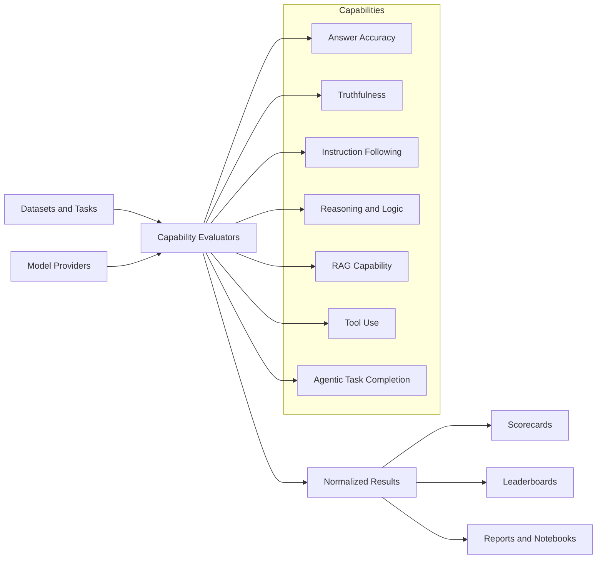
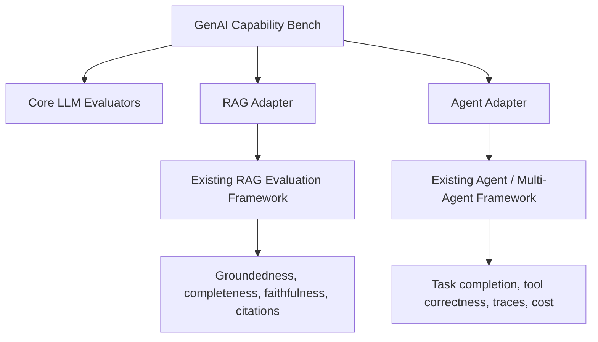

# GenAI Capability Bench

<div align="center">

**A modular benchmark suite for measuring what GenAI models and systems can do, and how well they do it**

[](https://www.python.org/downloads/)
[](.env.example)
[](.env.example)
[](.env.example)
[](notebooks/)

*Answer accuracy | truthfulness | instruction following | reasoning | RAG capability | tool use | agentic task completion*

</div>

---

## 🎯 Why This Repo

Most LLM evaluation projects quickly collapse into one of two shapes:

1. benchmark scripts that answer only *"which model got the most answers right?"*
2. safety tests that answer mainly *"where can the model go wrong?"*

This repo is focused on a different question:

> **What GenAI capabilities does a model or system have, and how reliably can it perform them across task types?**

The goal is to build a reusable capability testing suite that can evaluate both
base LLM behavior and system-level GenAI workflows. Safety and risk signals may
be captured as supporting diagnostics, but the organizing principle is
**capability measurement**, not red-team testing.

---

## 🧭 At a Glance



Every evaluator emits the same result contract:

```text
run_id + model + capability + task + output + metrics + score + pass/fail + cost + latency + metadata
```

That shared schema is the backbone of the project: it lets answer accuracy,
TruthfulQA-style truthfulness, instruction following, reasoning, RAG, tool use,
and agent workflows all roll up into comparable scorecards.

---

## 🧩 Capability Taxonomy

| Capability | What It Measures | Starter Metrics |
|---|---|---|
| **Answer Accuracy** | Whether the model answers factual questions correctly across domains such as history, science, math, law, literature, and business topics | exact match, contains match, token F1, semantic similarity |
| **Truthfulness** | Whether the model avoids common misconceptions and aligns more closely with correct answers than known incorrect answers | correct-vs-incorrect similarity margin, future LLM judge rubric |
| **Instruction Following** | Whether the model follows explicit user constraints | JSON validity, required terms, forbidden terms, word limits, regex checks |
| **Reasoning and Logic** | Whether the model can derive correct answers through arithmetic, symbolic reasoning, multi-hop logic, and contradiction handling | final-answer matching, future stepwise reasoning checks |
| **RAG Capability** | Whether a RAG system retrieves useful context and generates grounded, complete, cited answers | retrieval hit rate, groundedness, completeness, faithfulness, citation support |
| **Tool Use** | Whether the model chooses the right tools and calls them correctly | tool precision/recall/F1, argument validity, sequence quality |
| **Agentic Task Completion** | Whether an agent can plan, execute, validate, and complete tasks under cost and latency constraints | task score, trace completeness, tool correctness, cost, latency |

The first implementation focuses on the **core LLM capabilities**. RAG, tool use,
and agentic task completion are planned as adapters that align with existing local
evaluation repos rather than duplicating them.

---

## 🛠️ Current Build

The repo currently includes a working vertical slice:

```text
Core LLM Capability MVP
|-- answer accuracy evaluator
|-- truthfulness evaluator
|-- instruction-following evaluator
|-- reasoning / logic evaluator
|-- provider-agnostic model client interface
|-- deterministic mock client for smoke tests
|-- normalized result schema
|-- CLI runner
|-- summary tables and plots
`-- five demo notebooks
```

The smoke demo runs without API credentials by using a deterministic mock model.
Real provider runs can use OpenAI-compatible or Azure OpenAI settings through
environment variables.

---

## 📓 Demo Notebooks

The notebooks are designed as user-friendly demos and analysis runbooks. Heavy
logic lives in `src/`; notebooks stay readable, interactive, and report-oriented.

| Notebook | Purpose |
|---|---|
| [`01_answer_accuracy.ipynb`](notebooks/01_answer_accuracy.ipynb) | Evaluate factual QA and slice results by domain/category |
| [`02_truthfulness.ipynb`](notebooks/02_truthfulness.ipynb) | Run TruthfulQA-style correct-vs-incorrect scoring |
| [`03_instruction_following.ipynb`](notebooks/03_instruction_following.ipynb) | Check JSON, formatting, length, and constraint adherence |
| [`04_reasoning_logic.ipynb`](notebooks/04_reasoning_logic.ipynb) | Evaluate final-answer correctness for reasoning tasks |
| [`05_core_llm_leaderboard.ipynb`](notebooks/05_core_llm_leaderboard.ipynb) | Aggregate core capability results into a model scorecard |

Notebook flow:

```text
Capability overview
  -> dataset/task selection
  -> model selection
  -> evaluation run
  -> score summary
  -> visualization
  -> executive summary
  -> saved artifacts
```

---

## 🚀 Quickstart

Clone and install:

```bash
git clone https://github.com/minw0607/genai_capability_bench.git
cd genai_capability_bench

python -m venv .venv
source .venv/bin/activate
pip install -e ".[dev]"
cp .env.example .env
```

Run the local smoke demo:

```bash
python -m genai_capability_bench.core.runner configs/eval_core_demo.yaml
```

Expected artifact layout:

```text
outputs/runs/core_demo/
|-- metadata.json
|-- results.csv
|-- results.json
`-- summary.csv
```

Example summary from the smoke demo:

| Model | Capability | Category | Avg Score | Pass Rate |
|---|---|---|---:|---:|
| DemoMock | answer_accuracy | history | 1.00 | 1.00 |
| DemoMock | answer_accuracy | science | 1.00 | 1.00 |
| DemoMock | instruction_following | structured_output | 1.00 | 1.00 |
| DemoMock | reasoning_logic | arithmetic | 1.00 | 1.00 |
| DemoMock | truthfulness | general_misconceptions | 0.79 | 1.00 |

---

## 🔌 Provider Setup

Provider settings are read from `.env`:

```bash
OPENAI_GENERATION_MODEL=gpt-4o
OPENAI_JUDGE_MODEL=gpt-4o
OPENAI_EMBEDDING_MODEL=text-embedding-3-small

OPENAI_API_KEY=
OPENAI_BASE_URL=https://api.openai.com/v1
OPENAI_API_VERSION=

OPENAI_APIM_HEADER_NAME=
OPENAI_APIM_SUBSCRIPTION_KEY=
```

For Azure OpenAI, set `OPENAI_API_VERSION`. For direct OpenAI-compatible endpoints,
leave it blank and set `OPENAI_BASE_URL` as needed.

The repo includes two starter configs:

| Config | Purpose |
|---|---|
| [`configs/eval_core_demo.yaml`](configs/eval_core_demo.yaml) | Local mock-model smoke test; no credentials required |
| [`configs/eval_openai_compatible_template.yaml`](configs/eval_openai_compatible_template.yaml) | Real-model template that reads `${OPENAI_GENERATION_MODEL}`, `${OPENAI_API_VERSION}`, and other values from `.env` |

---

## ⚙️ Configuration-Driven Runs

Evaluations are configured with YAML:

```yaml
run_id: core_demo
dataset: datasets/samples/core_demo_tasks.json
output_dir: outputs/runs
default_pass_threshold: 0.7

models:
  - name: DemoMock
    provider: mock
    model: mock-model
```

Task files can be JSON, JSONL, or CSV. Each task maps into the shared
`EvalTask` schema:

```json
{
  "task_id": "accuracy_history_001",
  "capability": "answer_accuracy",
  "category": "history",
  "input_text": "Who was the first president of the United States?",
  "expected_output": "George Washington",
  "references": ["George Washington"]
}
```

---

## 🗂️ Repository Layout

```text
configs/                         Evaluation and model configs
datasets/samples/                 Small local demo datasets
docs/                             Design notes and development plan
notebooks/                        Demo-style capability notebooks
outputs/runs/                     Generated run artifacts
src/genai_capability_bench/
  adapters/                       Future RAG and Agent integration adapters
  capabilities/                   Capability-specific evaluators
  clients/                        Model client abstractions
  core/                           Schemas, experiment runner, registry
  metrics/                        Reusable scoring functions
  reporting/                      Tables, plots, summaries
tests/                            Unit and smoke tests
```

---

## 🛣️ Integration Roadmap

This repo is intended to sit above specialized evaluation repos and normalize
their outputs into capability scorecards.



Planned phases:

| Phase | Focus | Status |
|---|---|---|
| 1 | Core LLM MVP: answer accuracy, truthfulness, instruction following, reasoning | Started |
| 2 | Stronger semantic metrics and LLM-as-judge rubric library | Planned |
| 3 | Richer benchmark datasets and domain slicing | Planned |
| 4 | RAG adapter aligned with the existing RAG evaluation framework | Planned |
| 5 | Tool-use and agent adapters aligned with the existing Agent repo | Planned |
| 6 | Cross-run regression reporting and model comparison dashboards | Planned |

---

## 🛡️ Relationship to Safety Evaluation

Safety, robustness, and misuse testing are important, but this project is not
primarily a safety red-team suite. The capability lens asks:

- Can the model answer correctly?
- Can it reason?
- Can it follow constraints?
- Can it use context?
- Can it call tools?
- Can it complete agentic tasks?

Safety-related outcomes may be captured as metadata or diagnostic signals where
they affect capability, but they do not define the top-level taxonomy.

---

## 🏛️ Regulatory Alignment

This repo is designed to support evidence generation for AI governance, model
risk management, and internal assurance programs. It does **not** certify legal
compliance on its own; instead, it produces reproducible evaluation artifacts
that can help teams document model capability, limitations, monitoring results,
and control effectiveness.

| Standard / Guidance | Why It Matters | How This Repo Aligns |
|---|---|---|
| [NIST AI Risk Management Framework 1.0](https://www.nist.gov/itl/ai-risk-management-framework) | Voluntary framework for managing AI risks to individuals, organizations, and society | Supports the `Measure` and `Manage` functions through repeatable capability tests, scorecards, thresholds, and run artifacts |
| [NIST AI 600-1: Generative AI Profile](https://www.nist.gov/publications/artificial-intelligence-risk-management-framework-generative-artificial-intelligence) | GenAI-specific profile for identifying and managing risks unique to generative AI | Provides structured tests for answer quality, truthfulness, reasoning, instruction adherence, RAG grounding, and agent/tool behavior |
| [EU AI Act - Regulation (EU) 2024/1689](https://eur-lex.europa.eu/eli/reg/2024/1689/oj/eng) | Risk-based EU AI regulation covering safe and trustworthy AI systems, including obligations for high-risk and general-purpose AI contexts | Helps create technical evaluation evidence, benchmark records, model comparison outputs, and post-deployment monitoring inputs |
| [ISO/IEC 42001:2023](https://www.iso.org/standard/42001) | AI management system standard for governing AI development and use | Supports management-system practices through documented test procedures, versioned configs, evaluation records, and continuous improvement loops |
| [ISO/IEC 23894:2023](https://www.iso.org/standard/77304.html) | Guidance for AI-specific risk management across the AI lifecycle | Provides measurable capability indicators that can feed risk identification, analysis, evaluation, treatment, and monitoring |
| [OECD AI Principles](https://oecd.ai/en/ai-principles) | International principles for trustworthy AI, updated in 2024 to reflect general-purpose and generative AI developments | Aligns with transparency, accountability, robustness, and evidence-based evaluation practices |
| [OWASP Top 10 for LLM Applications](https://owasp.org/www-project-top-10-for-large-language-model-applications/) | Security-oriented guidance for LLM application risks, including prompt injection, output handling, excessive agency, and misinformation | Future tool-use and agentic evaluations can capture excessive agency, tool misuse, misinformation, and output-handling failure modes as diagnostic signals |

The intended audit trail is:

```text
evaluation config
  -> dataset/task version
  -> model/provider settings
  -> raw model outputs
  -> metric-level results
  -> capability scorecard
  -> reproducible artifacts for review
```

This makes the suite useful for internal model governance, vendor/model
comparison, pre-deployment validation, regression testing, and ongoing monitoring.

---

## 📚 References and Related Work

[1] Stephanie Lin, Jacob Hilton, and Owain Evans. [TruthfulQA: Measuring How Models Mimic Human Falsehoods](https://arxiv.org/abs/2109.07958). ACL, 2022.

[2] Percy Liang et al. [Holistic Evaluation of Language Models](https://arxiv.org/abs/2211.09110). arXiv, 2022.

[3] Dan Hendrycks, Collin Burns, Steven Basart, Andy Zou, Mantas Mazeika, Dawn Song, and Jacob Steinhardt. [Measuring Massive Multitask Language Understanding](https://arxiv.org/abs/2009.03300). ICLR, 2021.

[4] Aarohi Srivastava et al. [Beyond the Imitation Game: Quantifying and Extrapolating the Capabilities of Language Models](https://arxiv.org/abs/2206.04615). arXiv, 2022.

[5] Karl Cobbe, Vineet Kosaraju, Mohammad Bavarian, Mark Chen, Heewoo Jun, Lukasz Kaiser, Matthias Plappert, Jerry Tworek, Jacob Hilton, Reiichiro Nakano, Christopher Hesse, and John Schulman. [Training Verifiers to Solve Math Word Problems](https://arxiv.org/abs/2110.14168). arXiv, 2021.

[6] Shahul Es, Jithin James, Luis Espinosa-Anke, and Steven Schockaert. [RAGAS: Automated Evaluation of Retrieval Augmented Generation](https://arxiv.org/abs/2309.15217). EACL Demo, 2024.

[7] Zhilin Yang, Peng Qi, Saizheng Zhang, Yoshua Bengio, William W. Cohen, Ruslan Salakhutdinov, and Christopher D. Manning. [HotpotQA: A Dataset for Diverse, Explainable Multi-hop Question Answering](https://aclanthology.org/D18-1259/). EMNLP, 2018.

[8] Xiang Deng, Yu Gu, Boyuan Zheng, Shijie Chen, Samuel Stevens, Boshi Wang, Huan Sun, and Yu Su. [Mind2Web: Towards a Generalist Agent for the Web](https://arxiv.org/abs/2306.06070). NeurIPS, 2023.

[9] OpenAI. [Evals: A Framework for Evaluating LLMs and LLM Systems](https://github.com/openai/evals). GitHub.

[10] EleutherAI. [Language Model Evaluation Harness](https://github.com/EleutherAI/lm-evaluation-harness). GitHub.

[11] Stanford Center for Research on Foundation Models. [HELM: Holistic Evaluation of Language Models](https://crfm.stanford.edu/helm/).

[12] Exploding Gradients. [Ragas Documentation](https://docs.ragas.io/en/stable/).

[13] LangChain. [LangSmith Evaluation Documentation](https://docs.langchain.com/langsmith/evaluation).

[14] Confident AI. [DeepEval: The LLM Evaluation Framework](https://deepeval.com/docs/evaluation-introduction).

---

## 🧪 Development Notes

- Keep reusable implementation in `src/`.
- Keep notebooks coding-light and analysis-heavy.
- Make every run reproducible through config files.
- Preserve raw outputs and metric details for auditability.
- Prefer adapters over duplication when integrating with RAG or Agent repos.

See:

- [`docs/development_plan.md`](docs/development_plan.md)
- [`docs/capability_taxonomy.md`](docs/capability_taxonomy.md)
- [`docs/repo_integration_strategy.md`](docs/repo_integration_strategy.md)
