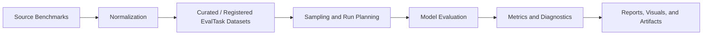
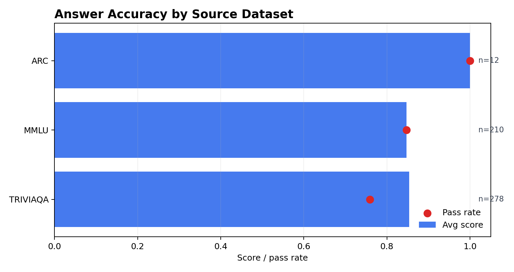
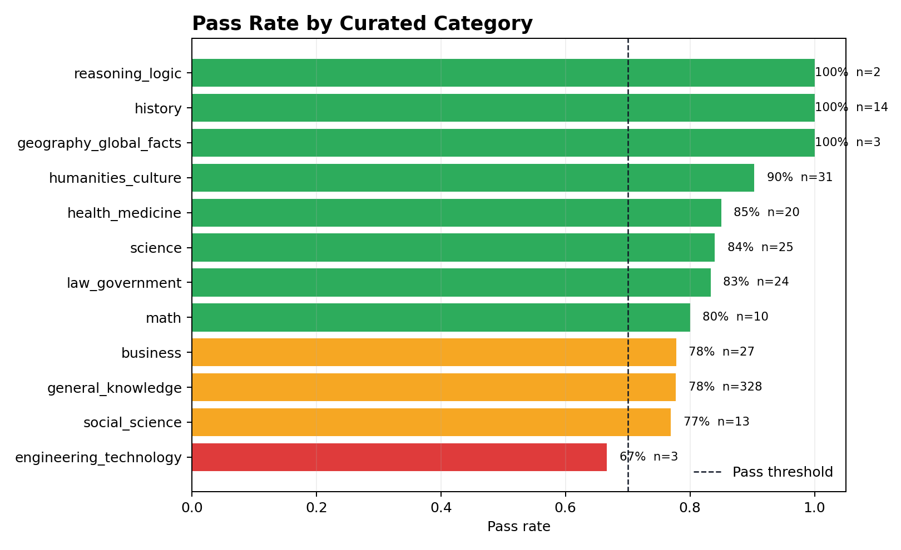
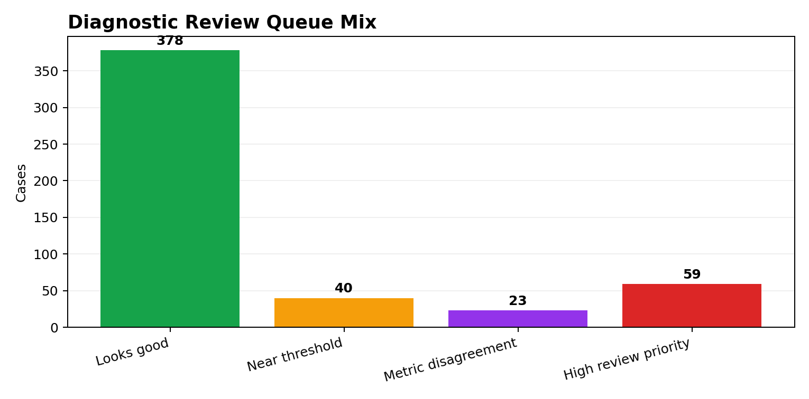

# Answer Accuracy Evaluation Framework

This page documents the Answer Accuracy framework used by GenAI Capability Bench. It is intended as a methodology guide for the repo, not merely a walkthrough of `01_answer_accuracy.ipynb`.

The notebook is the interactive demonstration layer. The framework described here is the reusable evaluation design behind it: how testing data is sourced, curated, sampled, scored, diagnosed, and reported.

---

## 1. Evaluation Objective

Answer Accuracy measures whether a model can produce an accepted factual answer for a given task.

This capability is intentionally narrower than truthfulness, RAG faithfulness, or agentic task completion:

| Boundary | Included in Answer Accuracy | Routed Elsewhere |
|---|---|---|
| Closed-book factual knowledge | Yes | - |
| Multiple-choice exam-style QA | Yes | - |
| Concise open-domain factual QA | Yes | - |
| Common misconception resistance | Supporting signal only | Truthfulness |
| Context-grounded reading comprehension | Not primary | RAG / context-grounded QA |
| Multi-hop evidence synthesis | Not primary | Reasoning / RAG |
| Tool-mediated answering | Not primary | Tool Use / Agentic workflows |

The core question is:

> Given a task and accepted reference answer(s), does the model produce an answer that should be counted as correct under the task's scoring profile?

---

## 2. Framework Overview

The framework separates evaluation into six layers:



| Layer | Purpose | Key Design Choice |
|---|---|---|
| Source Benchmarks | Bring in public or custom QA data | Preserve source integrity |
| Normalization | Convert heterogeneous schemas into `EvalTask` | Standard fields across datasets |
| Curated Dataset | Create a broad, local default benchmark | Add metadata, do not rewrite Q/A |
| Sampling | Control cost while preserving coverage | Stratified sampling by default |
| Scoring | Apply task-aware metrics | Dataset-aware scoring profiles |
| Reporting | Turn scores into evidence | Separate capability from reliability |

---

## 3. Data Sourcing Strategy

The default Answer Accuracy benchmark is `curated_knowledge_v1`, a local JSONL dataset built from compatible public benchmark caches.

Current sources:

| Source | Role | Included Rows |
|---|---|---:|
| MMLU | Broad academic and professional multiple-choice knowledge | 14,042 |
| TriviaQA | Concise open-domain factual QA | 17,944 |
| ARC Challenge | Science exam-style multiple-choice QA | 1,170 |
| **Total** | Versioned local curated benchmark | **33,156** |

Datasets intentionally excluded from this default closed-book benchmark:

| Dataset | Reason |
|---|---|
| Natural Questions | Current cache uses long-reference answers; better handled by a long-reference or context-grounded workflow |
| SQuAD | Requires context passages; better routed to RAG/context-grounded QA |
| HotpotQA | Multi-hop evidence setting; better routed to reasoning/RAG |
| TruthfulQA | Correct-vs-incorrect misconception evaluation; primary home is Truthfulness |

This routing is important. A high-quality benchmark suite should not collapse different task shapes into one generic "accuracy" score.

---

## 4. Curated Dataset Construction

The curated dataset is generated by:

```bash
PYTHONPATH=src python scripts/build_curated_answer_accuracy.py
```

Generated files:

| Artifact | Purpose |
|---|---|
| `datasets/curated/answer_accuracy_knowledge_v1.jsonl` | Versioned curated benchmark |
| `datasets/curated/answer_accuracy_knowledge_v1_manifest.json` | Dataset manifest with source counts, category counts, and curation policy |

Construction policy:

1. Load the largest available compatible normalized cache for each included source.
2. Copy source task text, expected answer, references, and incorrect references without rewriting them.
3. Preserve source scoring profile metadata, such as `multiple_choice` or `short_answer_qa`.
4. Add standardized taxonomy and provenance metadata.
5. Write the final dataset as one-record-per-line JSONL.

Curated schema:

| Field | Meaning |
|---|---|
| `task_id` | Stable curated task identifier |
| `capability` | `answer_accuracy` |
| `input_text` | Prompt/question sent to the model |
| `expected_output` | Primary accepted answer |
| `category` | Broad curated category |
| `subcategory` | Source category or source-specific slice |
| `references` | Accepted answer aliases/options |
| `incorrect_references` | Known incorrect references, when available |
| `metadata.curated_dataset` | Curated dataset version |
| `metadata.source_dataset` | Original benchmark source |
| `metadata.source_task_id` | Original normalized task ID |
| `metadata.source_cache_path` | Local normalized source cache |
| `metadata.scoring_profile` | Row-level scoring profile |

Integrity principle:

> The curated dataset may add taxonomy and provenance metadata, but it must not rewrite source questions, expected answers, or reference answers.

This creates a useful tension: source integrity is preserved, but source labels can still be imperfect. The diagnostics and optional judge review are therefore part of the framework, not an afterthought.

---

## 5. Sampling Policy

The full curated dataset has 33,156 rows. Evaluating the entire file can be expensive, so notebook run modes sample from it.

Default sampling for `curated_knowledge_v1` is **stratified**:

1. Balance across source datasets first: MMLU, TriviaQA, ARC.
2. Within each source, balance across broad curated categories where available.
3. Use the configured random seed for reproducibility.

For example, a 500-row curated sample targets approximately:

| Source | Approximate Rows |
|---|---:|
| MMLU | 167 |
| TriviaQA | 167 |
| ARC | 166 |

Why stratified sampling is the default:

- It prevents TriviaQA/general knowledge from dominating smaller report samples.
- It makes category-level visuals more interpretable.
- It improves executive reporting because observed weaknesses are less likely to be sampling artifacts.
- It still allows deterministic replay through seed and checkpoint fingerprints.

Users can override sampling:

```python
SAMPLE_STRATEGY = "auto"        # recommended; stratified for curated datasets
SAMPLE_STRATEGY = "stratified"  # force stratified sampling
SAMPLE_STRATEGY = "random"      # distribution-proportional random sampling
```

---

## 6. Scoring Profiles

Answer Accuracy uses dataset-aware scoring. There is no universal metric that is equally valid for every task shape.

| Profile | Primary Score | Best For |
|---|---|---|
| `multiple_choice` | Exact match against answer text or displayed option label | MMLU, ARC |
| `short_answer_qa` | `max(exact_match, 0.65 * token_f1 + 0.35 * semantic_similarity)` | TriviaQA-style concise QA |
| `long_reference_qa` | ROUGE/semantic blend | Long-reference Natural Questions variants |
| `source_preserved` | Row-level source profile preserved in task metadata | Curated mixed-source benchmark |

Supporting metrics:

| Metric | Role |
|---|---|
| Exact Match | Strict correctness signal |
| Token F1 | Lexical overlap |
| Semantic Similarity | Paraphrase-tolerant supporting signal |
| ROUGE-L | Sequence overlap for longer references |
| BLEU | Secondary lexical generation signal |
| Contains Match | Diagnostic only; can over-credit |
| LLM Judge | Optional adjudication for flagged/ambiguous cases |

The framework deliberately treats `contains_match` as diagnostic rather than primary. A model can include the right phrase inside an otherwise wrong answer.

---

## 7. Diagnostics and Judge Review

The framework does not stop at a score. It creates a review queue.

Common diagnostic flags:

| Flag | Meaning |
|---|---|
| High review priority | Very low profile score; likely incorrect or missing answer |
| Near threshold | Borderline failure requiring review |
| Metric disagreement | Metrics diverge; possible false positive or false negative |
| Contains-only credit | Contains match would over-credit the answer |
| Reference-shape warning | Reference format may not fit the task or metric |

Optional judge review is used only for selected flagged cases. It is not the primary evaluator.

Judge review is useful for:

- verbose but correct short-answer responses,
- semantically equivalent phrasing,
- ambiguous multiple-choice output formatting,
- suspected source-label issues,
- metric false negatives.

Judge review is risky for:

- uncalibrated production decisions,
- high-volume scoring without sampling,
- replacing deterministic metrics wholesale.

---

## 8. Reporting Model

The reporting layer separates three ideas:

| Dimension | Meaning |
|---|---|
| Capability Rating | How well the model performed on the benchmark sample |
| Evaluation Reliability | How much confidence we have in the measurement |
| Review Posture | How much manual/LLM-assisted inspection is recommended |

This separation matters. A model can score well while the evidence is unreliable, or score poorly because the benchmark/reference shape needs calibration.

Generated artifacts include:

| Artifact | Purpose |
|---|---|
| Executive HTML summary | Leadership-ready report |
| Technical Markdown report | Source-control friendly memo |
| Raw results CSV/JSON | Row-level audit trail |
| Diagnostics CSV | Review queue and metric details |
| Dataset summary CSV | Source/category performance |
| Dataset manifest CSV | Scope, split, scoring profile, fingerprint |
| Checkpoint JSONL | Resume/replay interrupted runs |

---

## 9. Illustrative Result

The latest illustrative run used a 500-row sample from `curated_knowledge_v1`. Exact results vary by model, sampling strategy, seed, judge settings, and provider configuration.

| Measure | Value |
|---|---:|
| Responses evaluated | 500 |
| Average score | 0.854 |
| Pass rate | 80.2% |
| Review-flagged cases | 122 |
| Judge-reviewed cases | 10 |
| Judge-rescued deterministic false negatives | 2 |







Interpretation:

- The run showed moderate-strong answer accuracy on the selected scope.
- Evaluation reliability was medium because judge review identified likely deterministic false negatives.
- Flagged rows should be reviewed before treating the headline score as final model-quality evidence.
- Source/category slices are more informative than one aggregate score.

---

## 10. How This Relates to the Notebook

The notebook operationalizes this framework:

| Notebook Section | Framework Function |
|---|---|
| Evaluation framing | Define capability scope |
| Dataset catalogs | Show benchmark inventory and routing |
| Configuration | Select model, dataset preset, run mode, sampling strategy |
| Pre-flight check | Confirm runnable scope before model calls |
| Run evaluation | Execute model calls with checkpointing |
| Diagnostics | Inspect failures and scoring disagreement |
| Visualization | Communicate source/category/metric patterns |
| Executive report | Convert evidence into a decision-ready summary |
| Save artifacts | List generated evidence files and folders |

The notebook is deliberately code-light. Heavy logic lives in `src/` so the framework can be reused by other notebooks, CI runs, and future capability modules.

---

## 11. Extending the Framework

Recommended extensions:

1. Add curated quality flags such as `source_answer_confidence`, `time_sensitive`, and `exclude_from_score`.
2. Add stronger semantic scoring options such as provider embeddings or BERTScore-style metrics.
3. Add source-specific dashboards for MMLU, TriviaQA, and ARC.
4. Add custom enterprise golden sets with the same `EvalTask` schema.
5. Add cross-run regression reporting for model upgrades.
6. Add a separate long-reference QA or RAG-grounded accuracy workflow.

The larger principle: answer accuracy evaluation is not just asking questions and counting exact matches. It is a benchmark design problem, a measurement-validity problem, and a communication problem.
